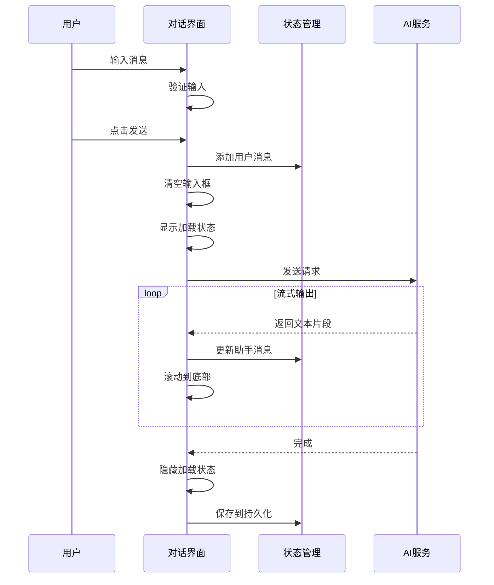
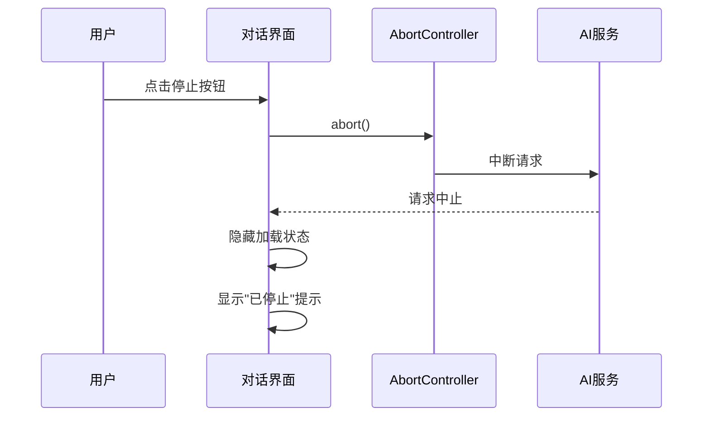
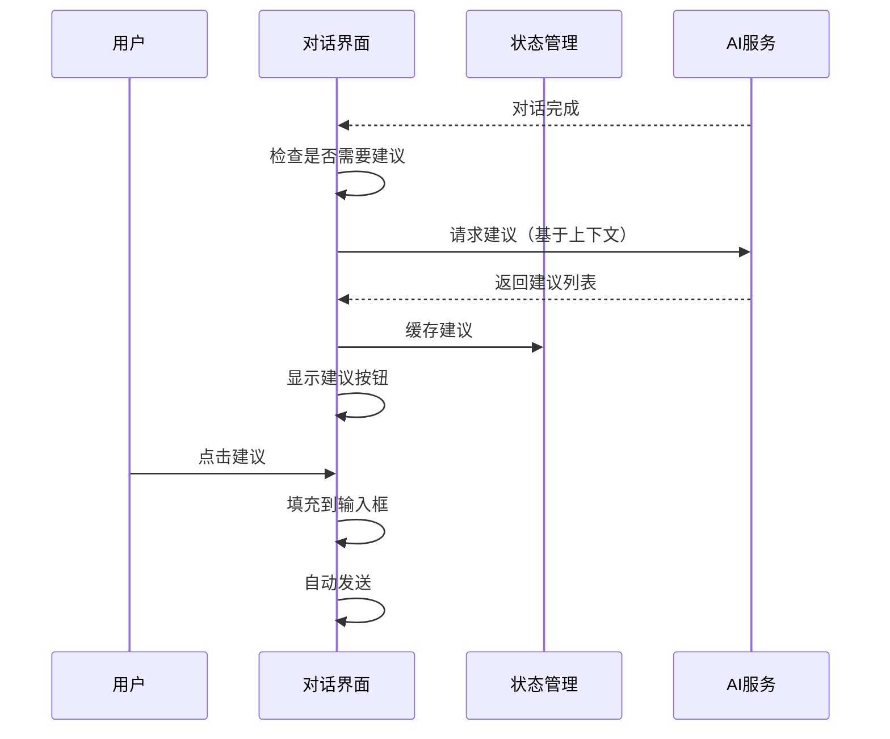

# 统一对话交互设计方案

**版本**: 1.0.0  
**日期**: 2025-10-09  
**状态**: 设计阶段

---

## 📋 目录

1. [概述](#概述)
2. [现状分析](#现状分析)
3. [功能规格](#功能规格)
4. [交互流程](#交互流程)
5. [UI/UX设计](#uiux设计)
6. [技术实现方案](#技术实现方案)
7. [数据模型](#数据模型)

---

## 概述

### 设计目标

统一桌面AI助手项目中所有对话界面的交互规范，提供一致的用户体验和可维护的代码架构。

### 适用范围

- **AI助手对话** (`Chat.tsx`) - 通用AI对话
- **桌面识别对话** (`OneClickDesktopChat.tsx`) - 医疗场景专用
- **智能体对话** (`AgentChat.tsx`) - Bisheng工作流集成

### 核心原则

1. **一致性优先** - 所有对话界面使用统一的交互模式
2. **渐进增强** - 基础功能稳定，高级功能可选
3. **性能优化** - 长对话场景下保持流畅
4. **可访问性** - 支持键盘操作和屏幕阅读器

---

## 现状分析

### 三个对话组件对比

| 特性 | Chat.tsx | OneClickDesktopChat.tsx | AgentChat.tsx |
|------|----------|------------------------|---------------|
| **状态管理** | useState + sessionStorage | useState (本地) | Zustand Store |
| **消息持久化** | sessionStorage + persistence.ts | localStorage (persistence.ts) | 内存 (无持久化) |
| **流式输出** | ✅ 支持 | ✅ 支持 | ✅ 支持 |
| **停止生成** | ❌ 缺失 | ❌ 缺失 | ✅ 支持 (abort) |
| **消息操作** | 复制/删除/重新生成 | 仅清空会话 | 无操作按钮 |
| **附件支持** | ✅ 文件/图片 | ✅ 截图 | ❌ 无 |
| **智能建议** | ❌ 无 | ❌ 无 | ❌ 无 |
| **错误处理** | toast提示 | toast提示 | 错误消息显示 |
| **会话管理** | 单会话 | 按患者ID分会话 | 按工作流分会话 |

### 主要问题

1. **状态管理不统一** - 三种不同的状态管理方式
2. **持久化策略混乱** - sessionStorage、localStorage、无持久化并存
3. **功能缺失** - 停止生成、智能建议等功能未全面实现
4. **代码重复** - 消息渲染、滚动逻辑、时间格式化等重复代码
5. **无统一接口** - 组件间无法复用逻辑

---

## 功能规格

### P0 - 核心功能（必需）

#### 1. 基础交互

- **文本输入**
  - 多行文本框，自动高度调整（最大5行）
  - Enter发送，Shift+Enter换行
  - 输入为空时禁用发送按钮
  - 支持粘贴文本和图片

- **消息发送**
  - 点击发送按钮或按Enter键
  - 发送后清空输入框
  - 自动聚焦输入框

- **消息显示**
  - 用户消息：右对齐，蓝色背景
  - 助手消息：左对齐，灰色背景
  - 系统消息：居中，浅色背景
  - Markdown渲染（代码高亮、表格、列表）

#### 2. 会话管理

- **内容缓存**
  - 用户离开后再返回，显示之前的对话历史
  - 使用Zustand Store统一管理
  - 可选持久化到localStorage/sessionStorage

- **新一轮对话**
  - 提供"清空对话"按钮
  - 清空前弹出确认对话框
  - 清空后重置会话状态

- **会话持久化**
  - 自动保存到本地存储
  - 支持多会话管理（按ID区分）
  - 限制最大消息数（默认500条）

#### 3. 流式输出控制

- **停止生成**
  - 模型开始输出后，显示"停止"按钮
  - 点击后中断流式输出
  - 使用AbortController实现

- **加载状态**
  - 显示"正在思考..."加载动画
  - 流式输出时显示打字指示器
  - 禁用输入框和发送按钮

#### 4. 自动滚动

- **滚动到底部**
  - 新消息到达时自动滚动
  - 流式输出时持续滚动
  - 用户手动滚动时暂停自动滚动

### P1 - 增强功能（重要）

#### 5. 消息操作

- **复制消息**
  - 点击复制按钮复制消息内容
  - 显示"已复制"提示

- **重新生成**
  - 仅对助手消息显示
  - 使用上一条用户消息重新请求
  - 替换原消息内容

- **删除消息**
  - 删除单条消息
  - 删除后自动保存

- **编辑消息**（可选）
  - 编辑用户消息后重新发送
  - 删除该消息之后的所有消息

#### 6. 智能建议

- **建议按钮**
  - 对话完成后显示3-5个后续问题建议
  - 建议内容由AI模型生成
  - 点击建议直接发送

- **动态生成**
  - 基于对话上下文生成
  - 缓存建议避免重复生成

#### 7. 多模态支持

- **图片上传**
  - 支持拖拽上传
  - 支持粘贴上传
  - 显示缩略图预览
  - 限制文件大小（默认10MB）

- **文件附件**
  - 支持文本文件（txt、md、json、xml）
  - 自动提取文件内容
  - 显示文件名和大小

- **代码块渲染**
  - 语法高亮
  - 复制代码按钮
  - 显示语言标签

### P2 - 高级功能（可选）

#### 8. 错误处理

- **网络错误**
  - 显示错误消息
  - 提供重试按钮
  - 自动重试机制（最多3次）

- **超时处理**
  - 默认超时60秒
  - 显示超时提示
  - 允许继续等待或取消

- **API限流**
  - 显示限流提示
  - 建议等待时间
  - 自动重试

#### 9. 无障碍访问

- **键盘快捷键**
  - `Ctrl/Cmd + K` - 聚焦输入框
  - `Ctrl/Cmd + L` - 清空对话
  - `Esc` - 停止生成
  - `↑/↓` - 浏览历史输入

- **屏幕阅读器**
  - ARIA标签
  - 语义化HTML
  - 焦点管理

#### 10. 性能优化

- **虚拟滚动**
  - 长对话（>100条消息）使用虚拟滚动
  - 减少DOM节点数量

- **消息分页**
  - 按需加载历史消息
  - 滚动到顶部时加载更多

- **防抖节流**
  - 输入框输入防抖
  - 滚动事件节流

#### 11. 用户体验

- **消息时间戳**
  - 显示发送时间
  - 相对时间（刚刚、5分钟前）
  - 绝对时间（悬停显示）

- **已读状态**
  - 标记已读/未读消息
  - 滚动到底部标记为已读

- **打字指示器**
  - 显示"正在输入..."
  - 流式输出时显示

#### 12. 数据导出

- **导出为Markdown**
  - 保留格式
  - 包含时间戳
  - 包含附件链接

- **导出为JSON**
  - 完整数据结构
  - 便于备份和迁移

---

## 交互流程

### 基础对话流程



### 停止生成流程



### 智能建议流程



---

## UI/UX设计

### 布局结构

```
┌─────────────────────────────────────────┐
│  对话标题 · 模型信息      [清空] [设置]  │ ← 头部栏
├─────────────────────────────────────────┤
│                                         │
│  ┌─────────────────────────────────┐   │
│  │ 用户消息                         │   │
│  └─────────────────────────────────┘   │
│                                         │
│  ┌─────────────────────────────────┐   │
│  │ 助手消息                         │   │
│  │ [复制] [重新生成] [删除]         │   │
│  └─────────────────────────────────┘   │
│                                         │ ← 消息列表区
│  ┌─────────────────────────────────┐   │
│  │ 建议: 如何优化性能?              │   │
│  │ 建议: 有哪些最佳实践?            │   │
│  └─────────────────────────────────┘   │
│                                         │
├─────────────────────────────────────────┤
│  ┌─────────────────────────────────┐   │
│  │ 输入框 (多行)                    │   │
│  └─────────────────────────────────┘   │
│  [📎] [🎤] [🌐]              [发送]    │ ← 输入区
└─────────────────────────────────────────┘
```

### 样式规范

#### 消息气泡

- **用户消息**
  - 背景: `bg-blue-600 dark:bg-blue-700`
  - 文字: `text-white`
  - 对齐: `ml-auto` (右对齐)
  - 最大宽度: `max-w-[80%]`
  - 圆角: `rounded-2xl rounded-tr-sm`

- **助手消息**
  - 背景: `glass` (玻璃效果) 或 `bg-gray-100 dark:bg-gray-800`
  - 文字: `text-gray-900 dark:text-gray-100`
  - 对齐: `mr-auto` (左对齐)
  - 最大宽度: `max-w-[80%]`
  - 圆角: `rounded-2xl rounded-tl-sm`

- **系统消息**
  - 背景: `bg-yellow-50 dark:bg-yellow-900/20`
  - 文字: `text-yellow-800 dark:text-yellow-200`
  - 对齐: `mx-auto` (居中)
  - 最大宽度: `max-w-[60%]`
  - 圆角: `rounded-lg`

#### 操作按钮

- **主要按钮** (发送)
  - 背景: `bg-primary`
  - 悬停: `hover:bg-primary/90`
  - 禁用: `disabled:opacity-50 disabled:cursor-not-allowed`

- **次要按钮** (复制、删除等)
  - 背景: `transparent`
  - 悬停: `hover:glass` 或 `hover:bg-gray-100 dark:hover:bg-gray-700`
  - 图标大小: `w-4 h-4`

#### 输入框

- 背景: `glass` 或 `bg-white dark:bg-gray-800`
- 边框: `border border-gray-200 dark:border-gray-700`
- 聚焦: `focus:ring-2 focus:ring-primary`
- 最小高度: `min-h-[44px]`
- 最大高度: `max-h-[120px]` (约5行)

### 动画效果

- **消息进入**: `fade-in-up` (淡入+上移)
- **加载动画**: `pulse` (脉冲)
- **按钮悬停**: `transition-all duration-200`
- **滚动**: `smooth` 平滑滚动

---

## 技术实现方案

### 状态管理架构

使用Zustand创建统一的对话Store：

```typescript
interface ChatStore {
  // 会话管理
  sessions: Map<string, ChatSession>;
  activeSessionId: string | null;
  
  // 消息操作
  addMessage: (sessionId: string, message: Message) => void;
  updateMessage: (sessionId: string, messageId: string, content: string) => void;
  deleteMessage: (sessionId: string, messageId: string) => void;
  clearSession: (sessionId: string) => void;
  
  // 状态控制
  setLoading: (sessionId: string, loading: boolean) => void;
  setError: (sessionId: string, error: string | null) => void;
  
  // 持久化
  saveToStorage: (sessionId: string) => void;
  loadFromStorage: (sessionId: string) => void;
}
```

### 组件架构

```
ChatContainer (容器组件)
├── ChatHeader (头部)
│   ├── SessionInfo
│   └── ActionButtons
├── MessageList (消息列表)
│   ├── VirtualScroller (虚拟滚动)
│   └── MessageItem (消息项)
│       ├── MessageBubble
│       ├── MessageActions
│       └── MessageTimestamp
├── SuggestionBar (建议栏)
│   └── SuggestionButton[]
└── ChatInput (输入区)
    ├── AttachmentPreview
    ├── TextArea
    └── ActionButtons
```

### 核心Hooks

```typescript
// 对话管理
useChatSession(sessionId: string)

// 消息发送
useSendMessage(sessionId: string)

// 流式输出
useStreamResponse(sessionId: string)

// 自动滚动
useAutoScroll(messagesRef: RefObject<HTMLDivElement>)

// 智能建议
useSuggestions(sessionId: string, enabled: boolean)
```

---

## 数据模型

### Message 接口

```typescript
interface Message {
  id: string;                    // 唯一标识
  sessionId: string;             // 所属会话
  role: 'user' | 'assistant' | 'system';
  content: string;               // 消息内容
  timestamp: number;             // 时间戳
  type?: 'text' | 'stream' | 'error';
  attachments?: Attachment[];    // 附件
  metadata?: Record<string, any>; // 元数据
}
```

### ChatSession 接口

```typescript
interface ChatSession {
  id: string;                    // 会话ID
  name: string;                  // 会话名称
  messages: Message[];           // 消息列表
  isLoading: boolean;            // 加载状态
  error: string | null;          // 错误信息
  suggestions: string[];         // 智能建议
  lastUpdate: number;            // 最后更新时间
  metadata?: Record<string, any>; // 扩展数据
}
```

### Attachment 接口

```typescript
interface Attachment {
  type: 'image' | 'file';
  name: string;
  url: string;                   // dataURL 或 文件路径
  size?: number;                 // 文件大小
  mimeType?: string;             // MIME类型
}
```

---

**下一步**: 创建开发规则文档 (`CHAT_COMPONENTS.md`)

