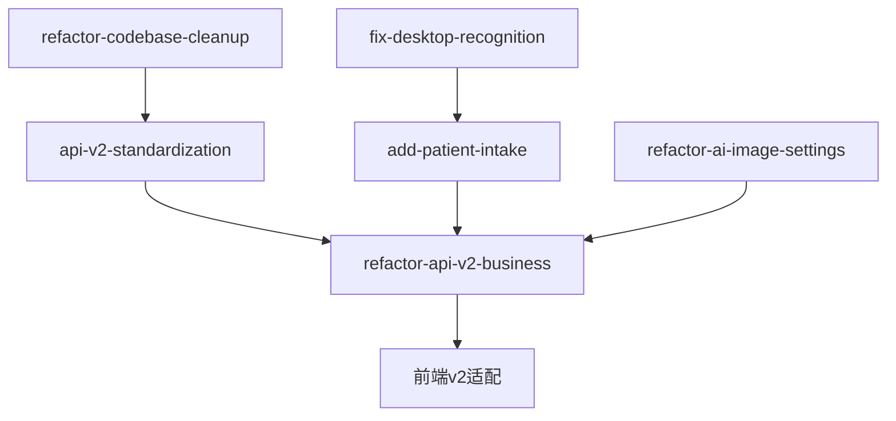

# OpenSpec 提案全面审核报告

**审核日期**: 2025-10-29  
**审核范围**: 所有活跃提案、业务逻辑、生产级质量标准、OpenSpec规范合规性  
**审核人**: AI Assistant

---

## 执行摘要

本次审核对项目的 OpenSpec 提案和当前实现状态进行了全面评估，发现了**5个P0级阻塞性问题**、**6个P1级重要问题**和**6个P2级一般问题**。主要问题集中在：

1. **v2 API完全未实现**（0%进度）
2. **v1响应结构不统一**（影响迁移）
3. **缺少关键性能保护机制**（限流、熔断、缓存）
4. **存在安全风险**（敏感数据泄漏）
5. **文档过于简略**（缺少实现细节）

**建议优先级**：立即启动阶段1紧急修复（1-2周），然后按顺序推进v2实现。

---

## 1. 当前任务状态评估

### 1.1 活跃提案进度

| 提案 | 总任务数 | 已完成 | 进行中 | 未开始 | 完成率 |
|------|---------|--------|--------|--------|--------|
| api-v2-standardization | 35 | 0 | 0 | 35 | 0% |
| refactor-api-v2-business | 37 | 0 | 0 | 37 | 0% |
| refactor-codebase-cleanup | 395 | ~300 | ~20 | ~75 | ~76% |
| add-patient-intake-ocr-extraction | 25 | 0 | 0 | 25 | 0% (待合并) |
| fix-desktop-recognition-vl-only-no-dialog | 22 | 18 | 0 | 4 | 82% |
| refactor-ai-image-settings-and-flows | 23 | 19 | 0 | 4 | 83% |

### 1.2 关键发现

#### ✅ 已完成的工作
- refactor-codebase-cleanup 的 P0 任务大部分完成
- 前端样式系统统一
- Legacy代码清理
- 配置管理API基础实现
- 桌面识别流程优化

#### ❌ 未完成的关键工作
- **v2 API完全未实现**：没有 `/v2` 路由，所有v2相关任务未开始
- **性能优化缺失**：连接池、限流、缓存、熔断均未实现
- **安全机制不完整**：敏感字段遮蔽、request_id追踪缺失
- **测试覆盖不足**：v2测试为0，严格JSON测试缺失

### 1.3 任务依赖关系



**关键依赖**：
- v2实现依赖于codebase-cleanup完成（已基本完成）
- 前端适配依赖于v2后端完成
- Vision相关提案应合并到v2 Vision轨道

---

## 2. v2 API 业务逻辑深度分析

### 2.1 响应结构一致性问题

#### 问题描述
v1当前实现与v2规范存在多处不一致：

| 端点 | 当前返回格式 | v2规范要求 | 问题 |
|------|-------------|-----------|------|
| `/v1/ai/health` | `{success, data: {providers: {...}}, meta}` | `{success, data: {services: {...}}, meta}` | 字段名不一致 |
| `/v1/vision/health` | `{success, services: {...}}` | `{success, data: {services: {...}}, meta}` | 缺少data包装和meta |
| `/v1/voice/health` | `{success, services: {...}}` | `{success, data: {services: {...}}, meta}` | 缺少data包装和meta |
| `/v1/ai/chat/stream` | SSE事件: `start\|chunk\|done\|error` | SSE事件: `chunk\|end\|error` | 事件类型不一致 |

#### 影响分析
- **前端适配困难**：需要维护多套解析逻辑
- **迁移成本高**：v1到v2迁移需要大量修改
- **用户体验差**：不同端点行为不一致

#### 优先级
**P0 - 阻塞性问题**

### 2.2 严格JSON策略实现缺陷

#### 问题描述
1. **Vision服务**：
   - ⚠️ 有`strict_json`参数，但实现不完整
   - ❌ 没有统一的`json_schema`验证
   - ❌ 失败时错误码不统一（应该是`no_result`）
   - ❌ 可能存在回退逻辑（违反规范）

2. **AI服务**：
   - ❌ 完全不支持`strict_json`
   - ❌ 没有`json_schema`验证

3. **错误处理**：
   - ❌ 没有统一的`no_result`错误码定义
   - ❌ 没有明确禁止回退和硬编码的代码审查机制

#### 规范要求
```python
# 请求参数
{
  "strict_json": true,
  "json_schema": "patient_info_v1"  # 或自定义schema
}

# 失败响应（注意：返回200状态码）
{
  "success": false,
  "error": {
    "code": "no_result",
    "message": "JSON解析失败: ...",
    "details": {...}
  },
  "meta": {
    "timestamp": "2025-10-29T...",
    "version": "2.0.0",
    "request_id": "..."
  }
}
```

#### 优先级
**P0 - 阻塞性问题**（医疗场景下数据准确性至关重要）

### 2.3 性能优化缺失

#### 2.3.1 连接池
**当前状态**：
- ✅ 数据库有连接池（pool_size=10, max_overflow=20）
- ❌ HTTP客户端（httpx）没有统一连接池
- ❌ 各Provider独立创建`httpx.AsyncClient`，没有复用

**影响**：
- 每次请求创建新连接，性能差
- 高并发下资源耗尽
- 连接建立开销大

**优先级**：P1

#### 2.3.2 超时和重试
**当前状态**：
- ⚠️ 部分实现：各Provider有timeout配置，但不统一
- ❌ 没有统一的重试策略（指数退避、最大重试次数）
- ❌ 没有区分可重试错误和不可重试错误

**影响**：
- 超时设置不合理可能导致请求堆积
- 缺少重试导致临时故障失败率高
- 无限重试可能导致雪崩

**优先级**：P1

#### 2.3.3 并发限流
**当前状态**：
- ❌ 完全缺失：没有全局并发限制
- ❌ 没有Provider级别的并发限制
- ❌ 没有速率限制（虽然requirements.txt有slowapi，但未使用）

**影响**：
- 服务可能被打垮
- 无法保护上游Provider
- 无法控制成本

**优先级**：P0

#### 2.3.4 缓存
**当前状态**：
- ❌ 完全缺失：虽然有Redis配置，但未实际使用
- ❌ GET/健康检查端点没有缓存
- ❌ 没有缓存失效策略

**影响**：
- 重复请求浪费资源
- 响应时间长
- 成本高

**优先级**：P1

#### 2.3.5 熔断和隔离
**当前状态**：
- ❌ 完全缺失：虽然requirements.txt有circuitbreaker，但未使用
- ❌ Provider故障不会隔离，会影响整体服务

**影响**：
- Provider故障导致雪崩
- 无法快速失败
- 恢复时间长

**优先级**：P2

### 2.4 安全性问题

#### 2.4.1 敏感字段遮蔽
**当前状态**：
- ⚠️ 前端有部分实现（logger.ts中的maskSensitiveData）
- ❌ 后端完全缺失：配置API返回完整配置，包括API key
- ❌ 日志中可能泄漏敏感信息

**示例问题**：
```python
# GET /v1/config 返回
{
  "OPENAI_API_KEY": "sk-proj-abc123...",  # ❌ 完整key泄漏
  "DEEPSEEK_API_KEY": "sk-def456...",     # ❌ 完整key泄漏
  "BISHENG_PASSWORD": "password123"       # ❌ 密码泄漏
}
```

**优先级**：P0 - 安全合规问题

#### 2.4.2 请求追踪
**当前状态**：
- ⚠️ 部分端点有request_id（如/v1/ai/chat）
- ❌ 不是所有端点都有request_id
- ❌ request_id不是自动生成的中间件
- ❌ 没有trace_id用于分布式追踪

**影响**：
- 问题排查困难
- 无法追踪请求链路
- 日志关联困难

**优先级**：P1

#### 2.4.3 错误信息泄漏
**当前状态**：
- ⚠️ 有全局异常处理器，但实现不完整
- ❌ 很多地方直接返回`str(e)`，可能泄漏内部信息
- ❌ 没有区分用户错误和系统错误

**示例问题**：
```python
except Exception as e:
    raise HTTPException(status_code=500, detail=str(e))  # ❌ 可能泄漏堆栈信息
```

**优先级**：P1

---

## 3. 业务域规范完整性评估

### 3.1 Common域（通用规范）

**当前状态**：✅ 基本完整

**缺失内容**：
- ❌ 错误码完整列表（只有示例）
- ❌ meta字段的详细定义
- ❌ 性能要求（响应时间、并发限制）

**建议补充**：
```markdown
### 标准错误码列表

| 错误码 | HTTP状态码 | 说明 | 可重试 |
|--------|-----------|------|--------|
| validation_error | 400 | 请求参数验证失败 | 否 |
| unauthorized | 401 | 未授权 | 否 |
| forbidden | 403 | 禁止访问 | 否 |
| not_found | 404 | 资源不存在 | 否 |
| conflict | 409 | 资源冲突 | 否 |
| rate_limited | 429 | 速率限制 | 是 |
| timeout | 504 | 请求超时 | 是 |
| provider_unavailable | 503 | Provider不可用 | 是 |
| upstream_error | 502 | 上游错误 | 是 |
| no_result | 200 | 严格JSON失败 | 否 |
| internal_error | 500 | 内部错误 | 否 |
```

### 3.2 AI域

**当前状态**：⚠️ 过于简略

**缺失内容**：
- ❌ 详细的请求/响应schema定义
- ❌ ChatOptions的完整字段列表
- ❌ 场景注入的具体实现规范
- ❌ 性能要求（响应时间、并发限制）
- ❌ 安全要求（API key管理、敏感数据处理）

**建议补充**：详见后续优化建议章节

### 3.3 Vision域

**当前状态**：⚠️ 过于简略

**缺失内容**：
- ❌ source输入格式的详细定义（url/base64的mime类型列表）
- ❌ strict_json失败的详细错误码和错误消息规范
- ❌ 图像大小限制和验证规则
- ❌ OCR语言支持列表
- ❌ 性能基准（处理时间、并发限制）

**建议补充**：详见后续优化建议章节

### 3.4 Voice域

**当前状态**：⚠️ 过于简略

**缺失内容**：
- ❌ audio输入格式的详细定义（支持的音频格式、采样率、比特率）
- ❌ 语言代码标准（ISO 639-1）
- ❌ 音频大小和时长限制
- ❌ TTS音色/语速参数定义
- ❌ 性能基准

**建议补充**：详见后续优化建议章节

### 3.5 Agent/Registry/Config/Tools域

**当前状态**：⚠️ 基本框架存在，但缺少细节

**共同缺失**：
- ❌ 详细的请求/响应schema
- ❌ 错误处理细节
- ❌ 性能和安全要求

---

## 4. 生产级质量标准检查

### 4.1 稳定性

| 检查项 | 状态 | 问题 |
|--------|------|------|
| 错误处理 | ⚠️ 部分 | 不统一，可能泄漏信息 |
| 降级策略 | ❌ 缺失 | 无降级机制 |
| 熔断机制 | ❌ 缺失 | 无熔断保护 |
| 超时控制 | ⚠️ 部分 | 不统一 |
| 重试策略 | ❌ 缺失 | 无统一重试 |

### 4.2 可扩展性

| 检查项 | 状态 | 问题 |
|--------|------|------|
| 模块化设计 | ✅ 良好 | 服务层分离清晰 |
| 插件化架构 | ⚠️ 部分 | Provider可扩展，但缺少规范 |
| 配置驱动 | ✅ 良好 | 使用Pydantic Settings |
| 版本控制 | ⚠️ 部分 | 有v1，v2未实现 |

### 4.3 可维护性

| 检查项 | 状态 | 问题 |
|--------|------|------|
| 代码组织 | ✅ 良好 | 目录结构清晰 |
| 文档完整性 | ⚠️ 部分 | 规范过于简略 |
| 测试覆盖率 | ⚠️ 部分 | 后端83%，前端未知，v2为0 |
| 日志规范 | ⚠️ 部分 | 格式不统一 |

### 4.4 性能

| 检查项 | 状态 | 问题 |
|--------|------|------|
| 响应时间 | ❓ 未知 | 无性能基准 |
| 并发处理 | ❌ 缺失 | 无并发限制 |
| 资源使用 | ❓ 未知 | 无监控 |
| 连接池 | ⚠️ 部分 | 仅数据库有 |
| 缓存 | ❌ 缺失 | 完全未使用 |

### 4.5 可观测性

| 检查项 | 状态 | 问题 |
|--------|------|------|
| 日志 | ✅ 良好 | 使用loguru |
| 指标 | ❌ 缺失 | 无Prometheus集成 |
| 追踪 | ❌ 缺失 | 无request_id中间件 |
| 健康检查 | ✅ 良好 | 有基础健康检查 |
| 告警 | ❌ 缺失 | 无告警机制 |

---

## 5. OpenSpec 规范合规性

### 5.1 文档结构检查

| 提案 | proposal.md | design.md | specs/*.md | tasks.md | 合规性 |
|------|------------|-----------|-----------|----------|--------|
| api-v2-standardization | ✅ | ✅ | ✅ | ✅ | ✅ 完全合规 |
| refactor-api-v2-business | ✅ | ✅ | ⚠️ 过简 | ✅ | ⚠️ 基本合规 |
| refactor-codebase-cleanup | ✅ | ❌ | ✅ | ✅ | ⚠️ 基本合规 |
| add-patient-intake | ✅ | ❌ | ✅ | ✅ | ⚠️ 基本合规 |
| fix-desktop-recognition | ✅ | ❌ | ✅ | ✅ | ⚠️ 基本合规 |
| refactor-ai-image-settings | ✅ | ❌ | ✅ | ✅ | ⚠️ 基本合规 |

### 5.2 文档一致性问题

1. **proposal → design 不一致**：
   - 部分提案有proposal但无design
   - 建议：为所有主要提案补充design.md

2. **design → specs 不一致**：
   - design提到的特性在specs中缺少详细定义
   - 建议：补充详细的API定义和验收标准

3. **specs → tasks 不一致**：
   - tasks中的任务与specs中的需求不完全对应
   - 建议：确保每个需求都有对应的任务

---

## 6. 问题优先级总结

### P0 - 阻塞性问题（必须立即解决）

1. ✅ **v2 API完全未实现**
2. ✅ **响应结构不统一**
3. ✅ **严格JSON策略未完整实现**
4. ✅ **缺少并发限流保护**
5. ✅ **敏感数据泄漏风险**

### P1 - 重要问题（应尽快解决）

1. ✅ **业务域规范过于简略**
2. ✅ **缺少HTTP连接池**
3. ✅ **缺少请求追踪机制**
4. ✅ **SSE事件结构不统一**
5. ✅ **缺少缓存机制**
6. ✅ **错误处理不统一**

### P2 - 一般问题（可以延后）

1. ✅ **缺少熔断机制**
2. ✅ **缺少性能基准测试**
3. ✅ **缺少监控和指标**
4. ✅ **文档组织混乱**
5. ✅ **缺少API版本协商**
6. ✅ **缺少幂等性支持**

---

**下一步**: 查看优化建议和修订计划

